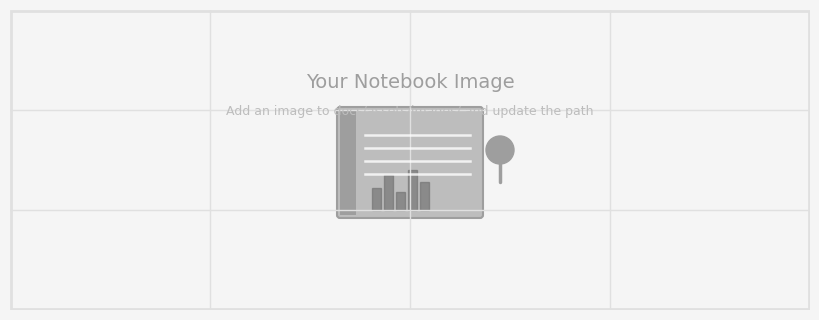

---
hide:
  - toc
  - navigation
---
<!--
CHECKLIST FOR THIS PAGE:
- [ ] Replace the two placeholder cards (marked [YOUR PROJECT ...]) with your real projects
- [ ] For each project: add a thumbnail image to docs/assets/images/ and update the path below
- [ ] For each project: create a project page by copying sample-project.md
- [ ] For each project: add a nav entry in mkdocs.yml (see the comments there)
- [ ] Delete placeholder cards you don't need yet
-->

# Projects

Portfolio under development. This page will highlight geospatial projects that I have undertaken.

**[Project 1](sample-project.md)**

Placeholder for a brief description of a project that I have undertaken.

`[TOOL 1]` `[TOOL 2]` `[TOOL 3]`

[View Project →](sample-project.md){ .md-button }

**[Project 2](sample-notebook.ipynb)**

Placeholder for a brief description of a project that I have undertaken.

`Python` `pandas` `Folium`

[View Project →](sample-notebook.ipynb){ .md-button }

